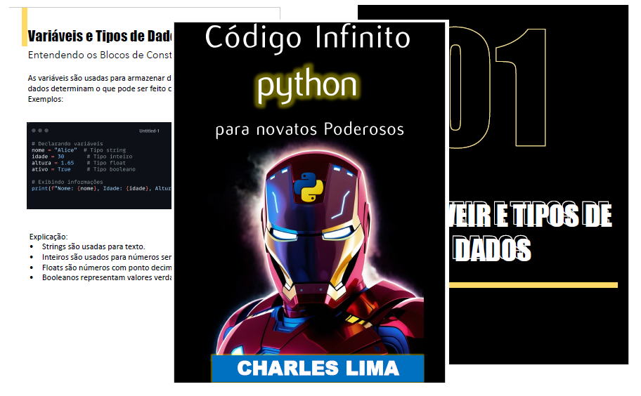

    

-------

# Projeto EBOOK Gerado por I.A.s

 > ℹ️ **NOTE:** Este é o repositório desenvolvido durante o curso no qual fui Aluno na plataforma da [DIO](https://dio.me)

Projeto com o objetivo de gerar um ebook digital com as facilidades das ferramentas de IA. todos os prompts
seguem abaixo.

<a href="https://github.com/Underdarkshadow/prompts-recipe-to-create-a-ebook/blob/main/E-book%20Template%20Avenger%20copy.pdf" title="View PDF now"> 📕Clique aqui para ler</a>

## 💻 Tecnologias utilizadas no projeto

- [ChatGPT](https://chat.openai.com/) 
- [LeonardoAI](https://app.leonardo.ai/)
- [PowerPoint](https://www.microsoft.com/en/microsoft-365/powerpoint)

## 🧠 Prompts

ChatGPT：

|   Ação   | prompt                                                                                                                                                                                                                                                                         |
| :------: | ------------------------------------------------------------------------------------------------------------------------------------------------------------------------------------------------------------------------------------------------------------------------------ |
|  título  | Crie um título de um E-BOOK sobre o tema de Phyton, o ebook é o tema de nicho de Linguagem de programação e o subnincho é para iniciantes o título deve ser épico e curto e tenha uma temática mais NERD ( estilo Avangers por exemplo ) Liste 5 variações de Títulos                                                        |
| conteúdo | Crie um texto para um Ebook chamado **"Dominando Python: Guia Prático de Estruturas e Funcionalidades Essenciais"**. O texto deve ensinar os conceitos fundamentais de Python, com as seguintes características:

1. **Explicações Simples**: Explique cada conceito de maneira clara e acessível para iniciantes.
2. **Texto Enxuto**: Foco na informação essencial, evitando explicações desnecessárias ou técnicas complexas.
3. **Exemplos de Código**: Cada tópico deve conter exemplos práticos e reais que demonstrem o uso das funcionalidades no dia a dia.
4. **Títulos Sugestivos por Tópico**: Use títulos atraentes como "Manipulando Listas como um Pro", "Explorando Dicionários para Dados Mais Ricos" ou "Entendendo Laços com For e While".
5. **Estrutura**:
    - Introdução breve explicando o que é Python e suas principais aplicações.
    - Uma lista de tópicos, com título, explicação e exemplo prático. Exemplos de tópicos:
        - Variáveis e Tipos de Dados
        - Listas, Tuplas e Dicionários
        - Condicionais e Laços de Repetição
        - Funções e Módulos
        - Manipulação de Arquivos
    - Encerramento com incentivo à prática e links de referência para estudo adicional.

Gere o conteúdo completo do ebook de acordo com essas regras. |

LeonardoAI：

|  Ação  | prompt                                                                                 |
| :----: | -------------------------------------------------------------------------------------- |
| título | Create an 8-bit style image of Iron Man's helmet set against the vast, starry expanse of outer space, with vibrant, neon-like hues of blues and purples dominating the background, while the helmet itself is rendered in metallic shades of red and gold, its sleek curves and angular lines meticulously detailed in a pixelated aesthetic, complete with subtle, glowing accents on the mask and chin, evoking the retro charm of classic arcade graphics.
 |

## ✨ Features

- Conteúdo gerado via ChatGPT
- Imagens geradas via LeonardoAI

## 📚 Materiais

- Imagens utilizadas em `assets`
- ebook gerado durante as aulas em `output`

## 🛠️ Instruções de execução

Utilize os prompts acima nas ferramentas sugeridas para gerar o material base e utilize uma ferramenta de edição de documentos como power point, libreoffice , indesign para diagramação.

## 👨‍💻 Expert

    
    
&nbsp&nbsp&nbspFelipe Aguiar 
    &nbsp&nbsp&nbsp
    <a href="https://github.com/felipeAguiarCode">
    GitHub</a>&nbsp;|&nbsp;
    <a href="www.linkedin.com/in/
felipe-exe">LinkedIn</a>
&nbsp;|&nbsp;
    <a href="https://www.instagram.com/felipeaguiar.exe/">
    Instagram</a>
&nbsp;|&nbsp;

  

---

⌨️ com 💜 por [Felipe Aguiar](https://github.com/felipeAguiarCode)
